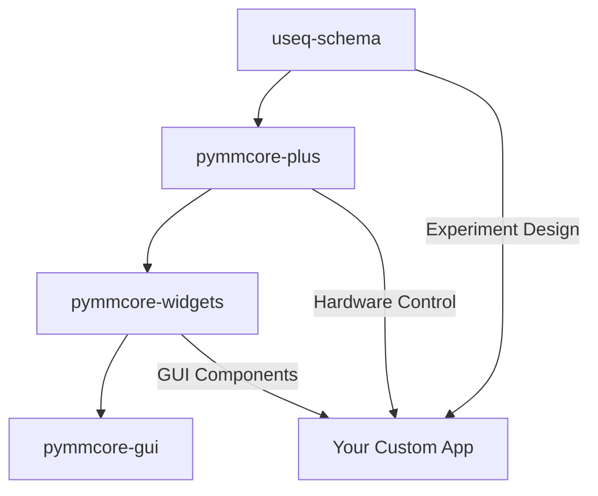

# Quickstart Guide

Welcome to the Python Micro-Manager ecosystem! This guide will help you get started quickly, whether you're looking for a ready-to-use application, a powerful Python library, or want to dive deep into the full ecosystem.

## Choose Your Path

=== "🖥️ GUI Application User"
    **Perfect if you:**
    
    - Want a complete microscopy application ready to use
    - Prefer graphical interfaces over coding
    - Need to get up and running quickly
    - Want all features pre-configured and integrated
    
    **Time to get started:** ~5 minutes

=== "🐍 Python Developer"
    **Perfect if you:**
    
    - Are comfortable with Python programming
    - Want to integrate microscopy into existing workflows
    - Need specific automation or custom analysis
    - Prefer building your own interfaces
    
    **Time to get started:** ~10 minutes

=== "🔧 Deep Developer"
    **Perfect if you:**
    
    - Want to understand the full architecture
    - Plan to extend or contribute to the ecosystem
    - Need maximum customization and control
    - Are building complex microscopy applications
    
    **Time to get started:** ~30 minutes

---

## Path 1: GUI Application User

Get a complete microscopy application with zero code required.

### Installation

The easiest way to get started is with the pre-built GUI application:

```bash
# Install using pip
pip install pymmcore-gui

# Or using conda
conda install -c conda-forge pymmcore-gui
```

### Launch the Application

```bash
# Start the GUI
pymm
```

The application will open with a modern, dockable interface including:

- **Device Property Browser** - Control all hardware settings
- **Live View** - Real-time camera display
- **MDA Designer** - Multi-dimensional acquisition planning
- **Image Viewer** - Built-in viewer with analysis tools
- **Stage Control** - XY and Z positioning
- **Snap & Live Controls** - Quick image capture

### Hardware Configuration

1. **Load Your Configuration**
   - Go to `File → Load Configuration`
   - Select your Micro-Manager `.cfg` file
   - Or use `Tools → Hardware Configuration Wizard` to create one

2. **Test Your Setup**
   - Click "Live" to start camera streaming
   - Use the stage controls to move around
   - Adjust camera settings in the Device Property Browser

3. **Run Your First Acquisition**
   - Open the MDA Designer dock
   - Set up channels, positions, time points, and Z-stacks
   - Click "Run MDA" to start acquisition

### Next Steps

- **[Hardware Configuration Guide](hardware-config.md)** - Detailed device setup
- **[MDA Planning Tutorial](mda-tutorial.md)** - Design complex experiments
- **[Image Analysis Workflows](analysis.md)** - Built-in analysis tools

---

## Path 2: Python Developer

Supercharge your microscopy workflows with powerful Python APIs.

### Installation

Install the core library for programmatic control:

```bash
# Install the enhanced core
pip install pymmcore-plus

# Optional: Add useq for experiment design
pip install useq-schema
```

### Your First Script

```python
from pymmcore_plus import CMMCorePlus

# Get the enhanced core instance
mmc = CMMCorePlus.instance()

# Load your hardware configuration
mmc.loadSystemConfiguration('path/to/your/config.cfg')

# Take a snapshot
mmc.snapImage()
image = mmc.getImage()

print(f"Captured image: {image.shape}")
```

### Key Productivity Features

#### 1. **Modern Event System**
React to hardware changes and acquisition events:

```python
# Connect to events
@mmc.events.imageSnapped.connect
def on_image_captured(image, metadata):
    print(f"New image: {image.shape}")
    # Process image immediately

@mmc.events.propertyChanged.connect  
def on_property_changed(device, prop, value):
    print(f"{device}.{prop} = {value}")
```

#### 2. **Multi-Dimensional Acquisitions**
Use declarative experiment design:

```python
from useq import MDASequence

# Define a complex experiment
sequence = MDASequence(
    channels=["DAPI", "FITC", "TRITC"],
    time_plan={"interval": 300, "loops": 24},  # Every 5 min for 2 hours
    z_plan={"range": 10, "step": 0.5},         # 10μm Z-stack
    stage_positions=[(100, 200), (300, 400)]   # Multiple positions
)

# Run it
mmc.run_mda(sequence)
```

#### 3. **Context Management**
Automatic state saving and restoration:

```python
# Safely change settings temporarily
with mmc:
    mmc.setExposure(100)  # Change exposure
    mmc.setProperty("Camera", "Gain", "High")
    # Take images with these settings
    images = [mmc.snapImage() for _ in range(10)]
# Settings automatically restored here
```

### Building Simple GUIs

Create custom interfaces with minimal code:

```python
import sys
from qtpy.QtWidgets import QApplication, QVBoxLayout, QWidget, QPushButton
from pymmcore_plus import CMMCorePlus
from pymmcore_widgets import LiveButton, SnapButton, ExposureWidget

app = QApplication(sys.argv)
mmc = CMMCorePlus.instance()

# Create a simple control panel
widget = QWidget()
layout = QVBoxLayout(widget)

# Add pre-built widgets
layout.addWidget(ExposureWidget())
layout.addWidget(SnapButton())
layout.addWidget(LiveButton())

widget.show()
mmc.loadSystemConfiguration('demo_config.cfg')
app.exec()
```

### Integration Patterns

#### With NumPy and SciPy
```python
import numpy as np
from scipy import ndimage

@mmc.events.imageSnapped.connect
def process_image(image, metadata):
    # Real-time analysis
    filtered = ndimage.gaussian_filter(image, sigma=1.0)
    mean_intensity = np.mean(filtered)
    print(f"Mean intensity: {mean_intensity}")
```

#### With Napari
```python
import napari

viewer = napari.Viewer()

@mmc.events.frameReady.connect  
def display_frame(image, event, metadata):
    # Live display in napari
    viewer.layers["live"].data = image
```

### Next Steps

- **[API Reference](api/core.md)** - Complete pymmcore-plus documentation
- **[Widget Gallery](widgets/gallery.md)** - Pre-built GUI components
- **[Integration Examples](examples/)** - Real-world workflows

---

## Path 3: Deep Developer

Master the full ecosystem architecture and customization.

### Understanding the Architecture

The pymmcore-plus ecosystem consists of four tightly integrated packages:



#### Layer 1: **useq-schema** (Foundation)
- **Purpose**: Implementation-agnostic experiment description
- **Key Features**: JSON/YAML serialization, validation, type safety
- **Use When**: Designing reusable experiment protocols

#### Layer 2: **pymmcore-plus** (Core Interface)  
- **Purpose**: Enhanced hardware control with modern Python APIs
- **Key Features**: Event system, acquisition engine, state management
- **Use When**: Building any microscopy application

#### Layer 3: **pymmcore-widgets** (GUI Components)
- **Purpose**: Reusable Qt widgets for microscopy UIs
- **Key Features**: Property browsers, MDA designers, viewers
- **Use When**: Building custom GUIs quickly

#### Layer 4: **pymmcore-gui** (Complete Application)
- **Purpose**: Full-featured application combining all components
- **Key Features**: Dockable interface, plugin system, workflows
- **Use When**: You need a complete solution

### Full Installation

Install the complete development environment:

```bash
# Core packages
pip install pymmcore-plus useq-schema pymmcore-widgets pymmcore-gui

# Development tools
pip install pytest pytest-qt pytest-cov black isort mypy

# Documentation tools  
pip install mkdocs mkdocs-material mkdocstrings

# Optional: For advanced features
pip install napari tensorstore zarr ome-zarr
```

### Advanced Customization

#### 1. **Custom Acquisition Engines**

Replace the default MDA engine with your own:

```python
from pymmcore_plus import CMMCorePlus
from useq import MDASequence, MDAEvent

class CustomMDAEngine:
    def __init__(self, mmcore: CMMCorePlus):
        self._mmc = mmcore
        
    def run(self, sequence: MDASequence):
        """Custom acquisition logic"""
        for event in sequence:
            # Your custom pre-event logic
            self._setup_hardware_for_event(event)
            
            # Acquire
            self._mmc.snapImage()
            
            # Your custom post-event logic
            self._process_event_data(event)

# Use your custom engine
mmc = CMMCorePlus.instance()
mmc.set_mda_engine(CustomMDAEngine(mmc))
```

#### 2. **Custom Device Adapters**

Extend hardware support:

```python
from pymmcore_plus import DeviceAdapter

class MyCustomDevice(DeviceAdapter):
    def __init__(self):
        super().__init__()
        self._position = 0
        
    def setPosition(self, pos: float):
        """Custom hardware communication"""
        # Your hardware-specific code
        self._send_command(f"MOVE {pos}")
        self._position = pos
        
    def getPosition(self) -> float:
        return self._position

# Register your device
mmc.loadDevice("MyDevice", "MyLibrary", "MyCustomDevice")
```

#### 3. **Plugin Development**

Extend the GUI application:

```python
from pymmcore_gui import MainWindow
from qtpy.QtWidgets import QDockWidget

class MyAnalysisPlugin(QDockWidget):
    def __init__(self, main_window: MainWindow):
        super().__init__("My Analysis", main_window)
        self._main_window = main_window
        self._setup_ui()
        
        # Connect to acquisition events
        main_window.mmc.events.frameReady.connect(self._process_frame)
        
    def _process_frame(self, image, event, metadata):
        # Your analysis code
        pass

# Register plugin
def register_plugin(main_window):
    plugin = MyAnalysisPlugin(main_window)
    main_window.addDockWidget(plugin)
```

### Development Workflow

#### 1. **Setting Up Development Environment**

```bash
# Clone the repositories
git clone https://github.com/pymmcore-plus/pymmcore-plus.git
git clone https://github.com/pymmcore-plus/pymmcore-widgets.git
git clone https://github.com/pymmcore-plus/pymmcore-gui.git

# Install in development mode
cd pymmcore-plus && pip install -e ".[dev]"
cd ../pymmcore-widgets && pip install -e ".[dev]"  
cd ../pymmcore-gui && pip install -e ".[dev]"
```

#### 2. **Running Tests**

```bash
# Run tests for each package
pytest pymmcore-plus/tests/
pytest pymmcore-widgets/tests/
pytest pymmcore-gui/tests/

# With coverage
pytest --cov=pymmcore_plus pymmcore-plus/tests/
```

#### 3. **Building Documentation**

```bash
# Build docs locally
cd pymmcore-plus && mkdocs serve
cd pymmcore-widgets && mkdocs serve  
cd pymmcore-gui && mkdocs serve
```

### Contributing

#### Code Style
- Use `black` for formatting: `black src/`
- Use `isort` for imports: `isort src/`
- Use `mypy` for type checking: `mypy src/`

#### Pull Request Process
1. Fork the repository
2. Create a feature branch
3. Add tests for new functionality
4. Update documentation
5. Submit pull request

### Advanced Examples

#### Real-time Analysis Pipeline
```python
import numpy as np
from pymmcore_plus import CMMCorePlus
from concurrent.futures import ThreadPoolExecutor

class AnalysisPipeline:
    def __init__(self):
        self.mmc = CMMCorePlus.instance()
        self.executor = ThreadPoolExecutor(max_workers=4)
        self.mmc.events.frameReady.connect(self._process_frame)
        
    def _process_frame(self, image, event, metadata):
        # Submit analysis to thread pool
        future = self.executor.submit(self._analyze_image, image, metadata)
        future.add_done_callback(self._analysis_complete)
        
    def _analyze_image(self, image, metadata):
        # CPU-intensive analysis
        return {
            'mean': np.mean(image),
            'std': np.std(image),
            'max': np.max(image)
        }
        
    def _analysis_complete(self, future):
        results = future.result()
        print(f"Analysis: {results}")
```

### Next Steps

- **[Architecture Deep Dive](architecture.md)** - Detailed system design
- **[API Documentation](api/)** - Complete reference for all packages
- **[Contributing Guide](contributing.md)** - How to contribute to the ecosystem
- **[Plugin Development](plugins.md)** - Building extensions and plugins

---

## Common Next Steps

No matter which path you chose, here are some common next steps:

### Hardware Setup
- **[Supported Hardware](hardware/supported.md)** - Compatible devices and drivers
- **[Configuration Guide](hardware/config.md)** - Setting up your microscope
- **[Troubleshooting](hardware/troubleshooting.md)** - Common issues and solutions

### Learning Resources
- **[Examples Gallery](examples/)** - Real-world code examples
- **[Video Tutorials](tutorials/)** - Step-by-step guides
- **[Community Forum](https://github.com/pymmcore-plus/pymmcore-plus/discussions)** - Get help and share knowledge

### Stay Updated
- **[Release Notes](changelog.md)** - What's new in each version
- **[Roadmap](roadmap.md)** - Planned features and improvements
- **[Newsletter](newsletter.md)** - Monthly updates and tips

---

## Getting Help

- **GitHub Discussions**: [Ask questions](https://github.com/pymmcore-plus/pymmcore-plus/discussions)
- **GitHub Issues**: [Report bugs](https://github.com/pymmcore-plus/pymmcore-plus/issues)
- **Documentation**: [Full docs](https://pymmcore-plus.github.io/)
- **Examples**: [Code samples](https://github.com/pymmcore-plus/pymmcore-plus/tree/main/examples)

Welcome to the Python Micro-Manager community! 🔬🐍
