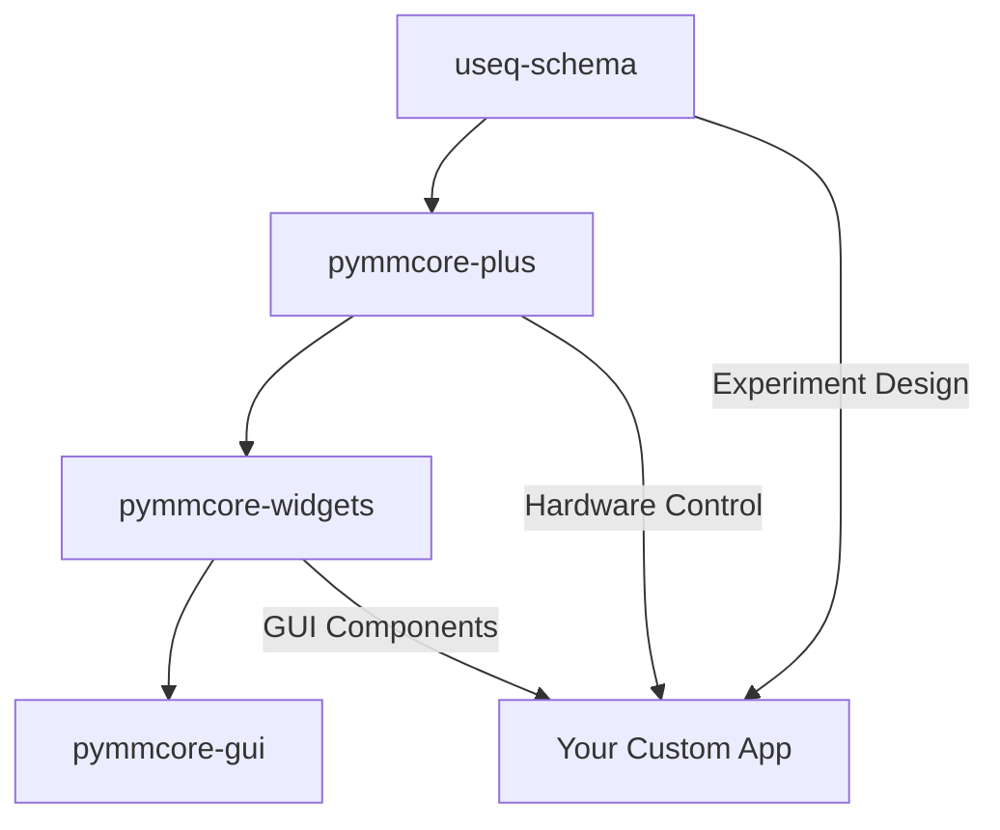

# 3. For Developers

Master the full ecosystem architecture and customization.

## Understanding the Architecture

The pymmcore-plus ecosystem consists of four tightly integrated packages:



### Layer 1: **useq-schema** (Foundation)

- **Purpose**: Implementation-agnostic experiment description
- **Key Features**: JSON/YAML serialization, validation, type safety
- **Use When**: Designing reusable experiment protocols

### Layer 2: **pymmcore-plus** (Core Interface)  

- **Purpose**: Enhanced hardware control with modern Python APIs
- **Key Features**: Event system, acquisition engine, state management
- **Use When**: Building any microscopy application

### Layer 3: **pymmcore-widgets** (GUI Components)

- **Purpose**: Reusable Qt widgets for microscopy UIs
- **Key Features**: Property browsers, MDA designers, viewers
- **Use When**: Building custom GUIs quickly

### Layer 4: **pymmcore-gui** (Complete Application)

- **Purpose**: Full-featured application combining all components
- **Key Features**: Dockable interface, plugin system, workflows
- **Use When**: You need a complete solution

## Full Installation

Install the complete development environment:

```bash
# Core packages
pip install pymmcore-plus useq-schema pymmcore-widgets pymmcore-gui

# Development tools
pip install pytest pytest-qt pytest-cov black isort mypy

# Documentation tools  
pip install mkdocs mkdocs-material mkdocstrings

# Optional: For advanced features
pip install napari tensorstore zarr ome-zarr
```

## Advanced Customization

### 1. **Custom Acquisition Engines**

Replace the default MDA engine with your own:

```python
from pymmcore_plus import CMMCorePlus
from useq import MDASequence, MDAEvent

class CustomMDAEngine:
    def __init__(self, mmcore: CMMCorePlus):
        self._mmc = mmcore
        
    def run(self, sequence: MDASequence):
        """Custom acquisition logic"""
        for event in sequence:
            # Your custom pre-event logic
            self._setup_hardware_for_event(event)
            
            # Acquire
            self._mmc.snapImage()
            
            # Your custom post-event logic
            self._process_event_data(event)

# Use your custom engine
mmc = CMMCorePlus.instance()
mmc.set_mda_engine(CustomMDAEngine(mmc))
```

### 2. **Custom Device Adapters**

Extend hardware support:

```python
from pymmcore_plus import DeviceAdapter

class MyCustomDevice(DeviceAdapter):
    def __init__(self):
        super().__init__()
        self._position = 0
        
    def setPosition(self, pos: float):
        """Custom hardware communication"""
        # Your hardware-specific code
        self._send_command(f"MOVE {pos}")
        self._position = pos
        
    def getPosition(self) -> float:
        return self._position

# Register your device
mmc.loadDevice("MyDevice", "MyLibrary", "MyCustomDevice")
```

### 3. **Plugin Development**

Extend the GUI application:

```python
from pymmcore_gui import MainWindow
from qtpy.QtWidgets import QDockWidget

class MyAnalysisPlugin(QDockWidget):
    def __init__(self, main_window: MainWindow):
        super().__init__("My Analysis", main_window)
        self._main_window = main_window
        self._setup_ui()
        
        # Connect to acquisition events
        main_window.mmc.events.frameReady.connect(self._process_frame)
        
    def _process_frame(self, image, event, metadata):
        # Your analysis code
        pass

# Register plugin
def register_plugin(main_window):
    plugin = MyAnalysisPlugin(main_window)
    main_window.addDockWidget(plugin)
```

## Development Workflow

### 1. **Setting Up Development Environment**

```bash
# Clone the repositories
git clone https://github.com/pymmcore-plus/pymmcore-plus.git
git clone https://github.com/pymmcore-plus/pymmcore-widgets.git
git clone https://github.com/pymmcore-plus/pymmcore-gui.git

# Install in development mode
cd pymmcore-plus && pip install -e ".[dev]"
cd ../pymmcore-widgets && pip install -e ".[dev]"  
cd ../pymmcore-gui && pip install -e ".[dev]"
```

### 2. **Running Tests**

```bash
# Run tests for each package
pytest pymmcore-plus/tests/
pytest pymmcore-widgets/tests/
pytest pymmcore-gui/tests/

# With coverage
pytest --cov=pymmcore_plus pymmcore-plus/tests/
```

### 3. **Building Documentation**

```bash
# Build docs locally
cd pymmcore-plus && mkdocs serve
cd pymmcore-widgets && mkdocs serve  
cd pymmcore-gui && mkdocs serve
```

## Contributing

### Code Style

- Use `black` for formatting: `black src/`
- Use `isort` for imports: `isort src/`
- Use `mypy` for type checking: `mypy src/`

### Pull Request Process

1. Fork the repository
2. Create a feature branch
3. Add tests for new functionality
4. Update documentation
5. Submit pull request

## Advanced Examples

### Real-time Analysis Pipeline

```python
import numpy as np
from pymmcore_plus import CMMCorePlus
from concurrent.futures import ThreadPoolExecutor

class AnalysisPipeline:
    def __init__(self):
        self.mmc = CMMCorePlus.instance()
        self.executor = ThreadPoolExecutor(max_workers=4)
        self.mmc.events.frameReady.connect(self._process_frame)
        
    def _process_frame(self, image, event, metadata):
        # Submit analysis to thread pool
        future = self.executor.submit(self._analyze_image, image, metadata)
        future.add_done_callback(self._analysis_complete)
        
    def _analyze_image(self, image, metadata):
        # CPU-intensive analysis
        return {
            'mean': np.mean(image),
            'std': np.std(image),
            'max': np.max(image)
        }
        
    def _analysis_complete(self, future):
        results = future.result()
        print(f"Analysis: {results}")
```

## Next Steps

- **[Architecture Deep Dive](architecture.md)** - Detailed system design
- **[API Documentation](api/)** - Complete reference for all packages
- **[Contributing Guide](contributing.md)** - How to contribute to the ecosystem
- **[Plugin Development](plugins.md)** - Building extensions and plugins

---

## Common Next Steps

No matter which path you chose, here are some common next steps:

## Hardware Setup

- **[Supported Hardware](hardware/supported.md)** - Compatible devices and drivers
- **[Configuration Guide](hardware/config.md)** - Setting up your microscope
- **[Troubleshooting](hardware/troubleshooting.md)** - Common issues and solutions

## Learning Resources

- **[Examples Gallery](examples/)** - Real-world code examples
- **[Video Tutorials](tutorials/)** - Step-by-step guides
- **[Community Forum](https://github.com/pymmcore-plus/pymmcore-plus/discussions)** - Get help and share knowledge

## Stay Updated

- **[Release Notes](changelog.md)** - What's new in each version
- **[Roadmap](roadmap.md)** - Planned features and improvements
- **[Newsletter](newsletter.md)** - Monthly updates and tips

---

## Getting Help

- **GitHub Discussions**: [Ask questions](https://github.com/pymmcore-plus/pymmcore-plus/discussions)
- **GitHub Issues**: [Report bugs](https://github.com/pymmcore-plus/pymmcore-plus/issues)
- **Documentation**: [Full docs](https://pymmcore-plus.github.io/)
- **Examples**: [Code samples](https://github.com/pymmcore-plus/pymmcore-plus/tree/main/examples)

Welcome to the Python Micro-Manager community! 🔬🐍
